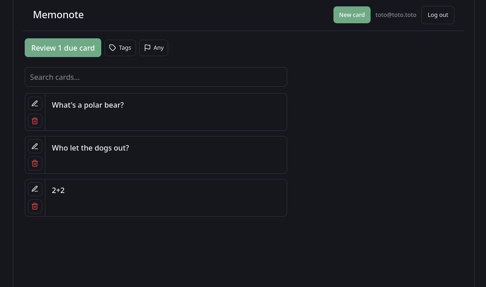
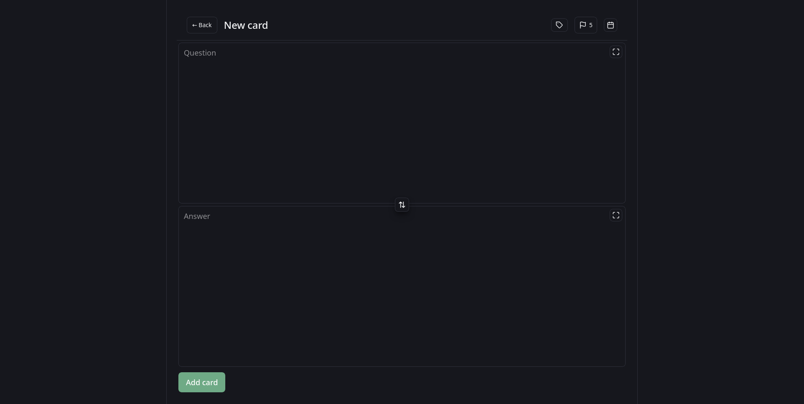
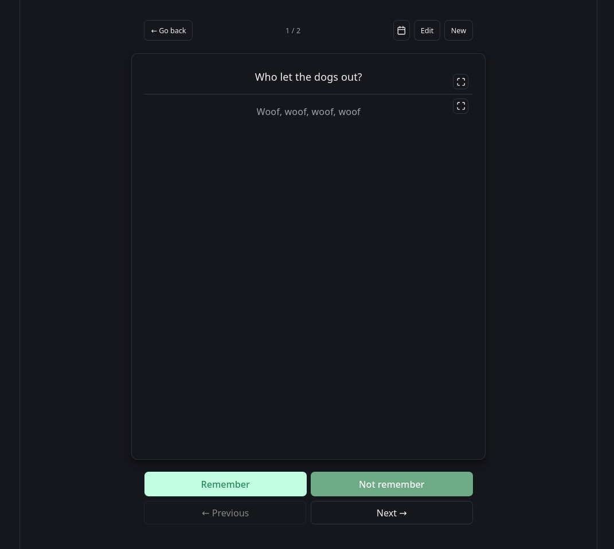

# Memonote

A web app for taking **memo notes as question–answer pairs** — small flashcard-like
cards you can review and search. You **create question/answer pairs**, review the
ones that are due, and **filter them by tag and by priority** (plus client-side
fuzzy search). The defining constraints of the project:

- **End-to-end encryption (E2EE).** Note contents are encrypted in the browser
  before anything leaves the device. The server only ever stores ciphertext and
  never has access to the keys, so it cannot read your notes.
- **Client-side fuzzy search.** Search runs entirely in the front end over the
  decrypted cards — the server is never asked to search (it couldn't anyway,
  since it only holds ciphertext).

Cards are stored on the server as opaque, client-encrypted blobs; the front end
reads and writes them directly over the network, decrypting in memory to display
and search. A **local-first IndexedDB cache** (to work offline against a local
copy of the data) was planned, but it's been **dropped for the moment** — the
sync and conflict handling it required added too much complexity for where the
project is now. It may return later.

## Screenshots

**Home** — your cards, with "review due cards", tag and priority filters, and
fuzzy search:



**New card** — create a question/answer pair, with tag, priority and due-date
controls:



**Review** — flip through due cards and mark each remembered or not:



## Repository layout

```
note-app/
├── front/      React + TypeScript + Vite single-page app (the UI)
├── back/       Go HTTP API (users, sessions, card sync)
├── cicd/       Build/run scripts and local Postgres + migration tooling
├── secrets/    Local-only credential env files (git-ignored)
└── external/   Vendored binaries (e.g. dbmate) (git-ignored)
```

## Current status

This is an early-stage project. What exists today:

- **Backend:** user signup (`POST /users`) plus session auth — `POST /sessions`
  (login), `DELETE /sessions` (logout) and `GET /me` (current user). Sessions
  use a server-side store with an opaque, hashed token delivered as an
  `HttpOnly`, `Secure`, `SameSite=Lax` cookie. Card sync endpoints store opaque
  encrypted blobs: `GET /cards` (optionally `?since=` for incremental sync),
  `PUT /cards` (batch upsert) and `DELETE /cards/{id}` (tombstone).
- **Frontend:** the login / sign-up screen wired to the real endpoints, the
  client-side encryption (key derivation + AES-GCM), and card CRUD with review
  scheduling and client-side fuzzy search. The session is restored on page load
  via `GET /me`, so a refresh keeps you logged in (the in-memory encryption key
  is also restored from this tab's `sessionStorage`).

The **local-first IndexedDB cache** is the main piece deliberately left out for
now (see above) — every card read/write currently hits the server.

### Session security model

- The session token is 256 bits of CSPRNG randomness. The database stores only
  its SHA-256 hash, so a DB leak cannot be replayed as a valid session.
- The cookie is `HttpOnly` (JS can't read it → resistant to token theft via
  XSS), `Secure` (HTTPS only), and `SameSite=Lax` (resistant to CSRF).
- Login failures are deliberately vague and run in roughly constant time, so an
  attacker can't tell whether an email is registered.

## Architecture intent (where this is heading)

Because of the E2EE requirement, the backend is deliberately "dumb" about note
contents. The likely split:

- **Frontend** derives an encryption key from the user's password (see
  _Encryption & key derivation_ below), encrypts/decrypts cards in the browser,
  and does all searching there.
- **Backend** authenticates users and stores **opaque encrypted blobs** for
  cross-device sync — never plaintext, never keys.

### Encryption & key derivation

Resolved design (this settles the "handle the shared password carefully" point
that used to live here). **One password, split on the client** — the
"Bitwarden model" — using **Argon2id**:

1. **Salt.** The KDF salt is derived deterministically from the account's
   normalized email, namespaced with an app constant (e.g. `"memonote:" +
email`). Salts only need to be unique per account, not secret; using the
   email lets any device re-derive the keys from just email + password with no
   server round-trip, and avoids a "look up salt by email" endpoint that would
   leak which emails are registered.
2. **Master key.** `masterKey = Argon2id(password, salt, params)` — memory-hard,
   run once per login in the browser (WASM). Params (memory / iterations /
   parallelism) are pinned and versioned so they can be strengthened later.
3. **Two independent sub-keys via HKDF**, using different context labels:
   - `encryptionKey = HKDF(masterKey, "memonote-enc")` — an AES-GCM key that
     encrypts/decrypts card blobs. **Never leaves the device.**
   - `authCredential = HKDF(masterKey, "memonote-auth")` — sent to the server in
     place of the password at signup and login.

   HKDF is one-way and the labels are independent, so holding `authCredential`
   reveals nothing about `encryptionKey`.

4. **What the server sees.** Only `authCredential`, which it treats exactly like
   today's "password": it stores a **bcrypt** hash of it, so even a DB leak
   doesn't reveal `authCredential`. The server never receives the raw password,
   the master key, or the encryption key — so it _cannot_ derive the encryption
   key. The existing `POST /users` / `POST /sessions` endpoints are unchanged;
   only the **client** changes what it puts in the credential field.
5. **Cross-device.** Everything is derived deterministically from email +
   password, so a new device reconstructs the same keys with **no key material
   stored anywhere**.

Accepted consequences:

- **No recovery.** Forgetting the password makes the notes unrecoverable — there
  is no server-side key escrow. (An optional client-generated recovery key could
  be added later.)
- **Password / email change** re-derives the keys, so it needs client-side
  re-encryption (decrypt each blob with the old key, re-encrypt with the new,
  re-upload). Handled when those features are built.

Steps 13–14 implement this; steps 15–18 assume the server stores only ciphertext
blobs plus the bcrypt of `authCredential`.

## Frontend (`front/`)

React + TypeScript app built with Vite.

```bash
cd front
npm install
cp .env.example .env     # optional; defaults to http://localhost:8081
npm run dev              # dev server, usually http://localhost:5173
npm run build            # type-check + production build
```

Code map:

| File                          | Responsibility                                                 |
| ----------------------------- | -------------------------------------------------------------- |
| `src/api/client.ts`           | Typed `fetch` wrapper: base URL, JSON, error handling.         |
| `src/api/auth.ts`             | `signup()` / `login()` calls and their request/response types. |
| `src/components/AuthForm.tsx` | The shared email + password form (login & signup).             |
| `src/pages/AuthPage.tsx`      | Login/Sign-up tab toggle around the form.                      |
| `src/App.tsx`                 | Holds auth state; switches between auth screen and home.       |

## Backend (`back/`)

Go HTTP API using `net/http` and `pgx` (Postgres).

```bash
# Requires a running Postgres and the env files under cicd/ and secrets/.
./cicd/back/run.sh            # go run
./cicd/back/build_and_run.sh  # build a binary, then run it
```

The server listens on `:8081`.

## TODO

- The logged user decypher key is being deprecated when another user logs in from another window, because it changes the session cookie
